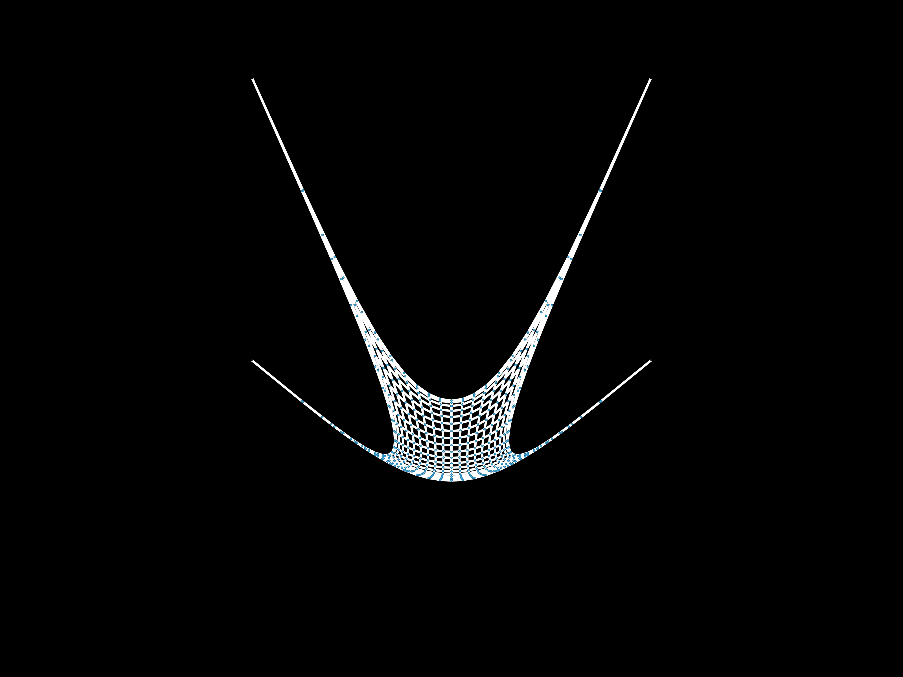

# FDM: Force Density Method

Revised code from previous editions to be more portable and query-able. Inspired by [jax_fdm](https://github.com/arpastrana/jax_fdm) by Rafael Pastrana.

Will eventually be integrated into [Asap.jl](https://github.com/keithjlee/Asap).

